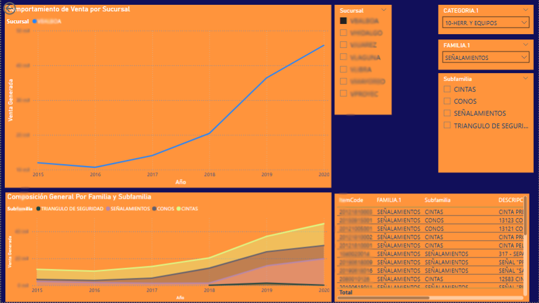
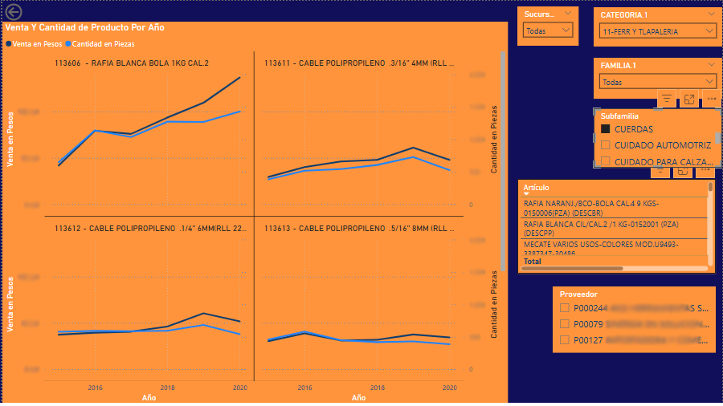
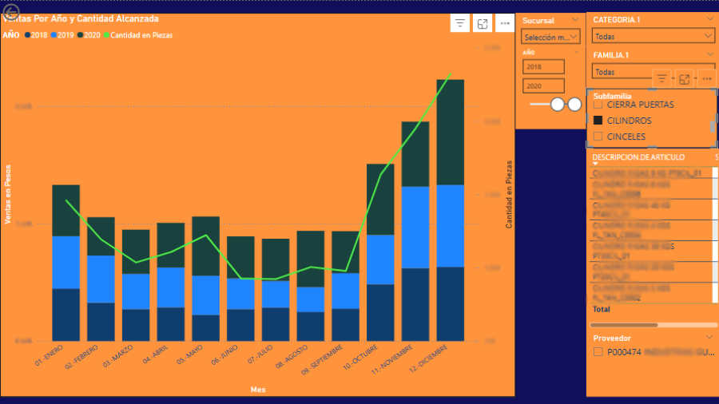
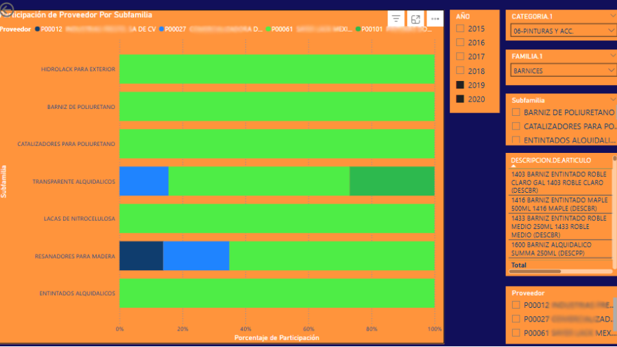
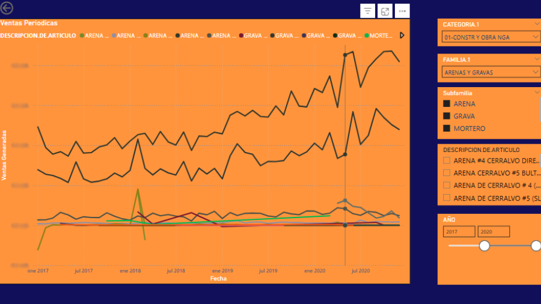

# Cruce_Categorías – Reporte Power BI

**Cruce_Categorías** es un prototipo de reporte Power BI con 5 pestañas, desarrollado para demostrar el alcance y el valor estratégico de implementar una administración rigurosa de categorías (*category management*) en el análisis y gestión de inventario de más de 12,000 SKUs, incluyendo productos activos e históricos.

La integración de familias y subfamilias, en colaboración con compradores, gerentes de tienda, especialistas y proveedores, permitió sentar las bases para posteriormente visualizar y segmentar la información de productos de una manera más precisa y accionable. Este reporte facilita la toma de decisiones fundamentadas y ágiles por parte de los equipos de compras, mostrando cómo una correcta categorización transforma los datos en ventajas competitivas.

---

## 1. venta_sucursal

**Propósito:**  
Permite visualizar las ventas generales por sucursal a lo largo del año, filtrando por familia, subfamilia o SKU específico.

- **Gráfico superior:** Ventas totales por sucursal (año a año).
- **Gráfico inferior:** Desempeño histórico de productos que componen cada familia o subfamilia, facilitando el análisis de tendencias y estacionalidades.

---

## 2. performance_productos

**Propósito:**  
Presenta el performance de cada producto dentro de una subfamilia a través de gráficas de líneas, permitiendo comparativos directos y visualización de patrones individuales o grupales dentro de la categoría seleccionada.

---

## 3. venta_acumulada_cantidadXaño

**Propósito:**  
Ofrece un análisis combinado de ventas acumuladas tanto en valor (gráficas de barras apiladas en pesos) como en volumen (líneas de ventas en piezas), segmentando por producto, familia o subfamilia y facilitando la lectura de la evolución a lo largo de los años permitiendo detectar diferencias por mes.

---

## 4. participacion_proveedores

**Propósito:**  
Visualiza la participación de los proveedores dentro de una familia o subfamilia, identificando niveles de dependencia o concentración con determinados proveedores. Esta vista es fundamental para la gestión de riesgo y la negociación comercial, proporcionando argumentos sólidos para la toma de decisiones estratégicas.

---

## 5. venta_fechas_granular

**Propósito:**  
Permite analizar las ventas de forma granular (semestre, trimestre, mes) para cualquier familia, subfamilia o producto. El objetivo es identificar variaciones, tendencias o anomalías a nivel temporal, mejorando la planeación y la respuesta táctica.

---

## 🧠 Reflexión sobre la administración de categorías

La administración de categorías representa una evolución significativa en la gestión de inventarios y compras. Al estructurar la base de datos con familias y subfamilias, la organización puede acceder a vistas mucho más profundas y accionables sobre el desempeño de cada producto, proveedor y segmento del negocio. Este enfoque no solo optimiza la capacidad de análisis, sino que habilita procesos más eficientes en negociación, control de inventarios, identificación de oportunidades y mitigación de riesgos.

El prototipo **Cruce_Categorías** evidencia cómo, a partir de una correcta clasificación y colaboración interdisciplinaria, se potencia la inteligencia de negocio y se habilita un seguimiento mucho más estratégico, claro y granular del portafolio de productos, impulsando la toma de decisiones orientadas a la rentabilidad y la competitividad.

---

> **Nota:**  
> Los datos contenidos en las imágenes han sido editados y anonimizados por motivos de confidencialidad.
> Las visualizaciones presentadas son únicamente demostrativas del diseño, estructura y alcance del modelo desarrollado.
